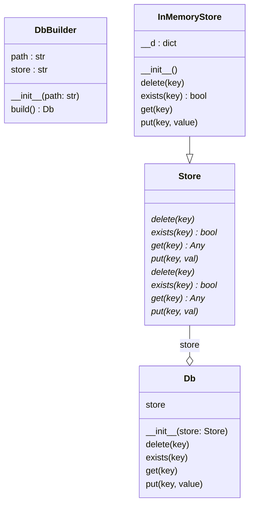

# CaillouDB

A very slow key-valye store - single node - object-storage backed.

# Features

- Async first

# Quickstart
```python

```

# Class Diagram


```mermaid
classDiagram
  class Db {
    store
    \_\_init\_\_(store: Store)
    delete(key)
    exists(key)
    get(key)
    put(key, value)
  }
  class DbBuilder {
    path : str
    store : str
    \_\_init\_\_(path: str)
    build() Db
  }
  class InMemoryStore {
    \_\_d : dict
    \_\_init\_\_()
    delete(key)
    exists(key) bool
    get(key)
    put(key, value)
  }
  class Store {
    delete(key)*
    exists(key)* bool
    get(key)* Any
    put(key, val)*
  }
  class Store {
    delete(key)*
    exists(key)* bool
    get(key)* Any
    put(key, val)*
  }
  InMemoryStore --|> Store
  Store --o Db : store
```