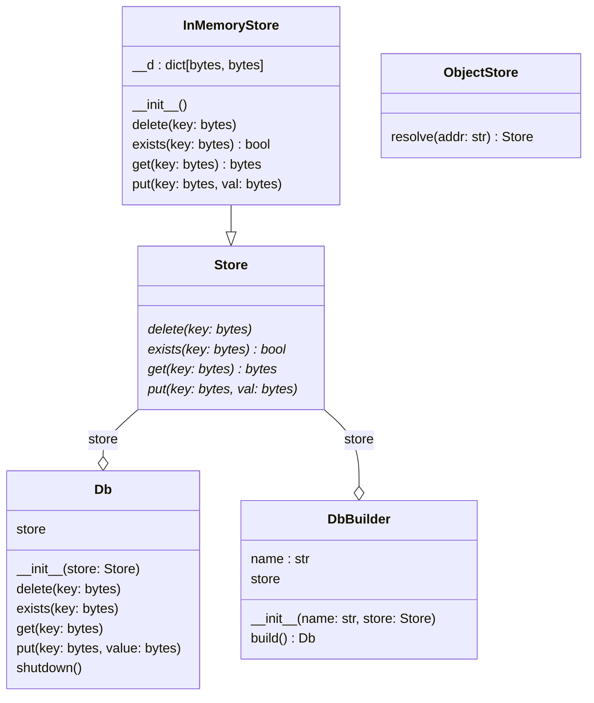

# CaillouDB

A very slow embedded key-valye store - single node - single-writer - object-storage backed.

# Features

- Async api
- Basic CRUD operations (in memory)
- Atomic batch write (in memory)

# Quickstart
```python
import asyncio

from cailloudb import (
    ObjectStore,
    DbBuilder
)

async def main():
    store = ObjectStore.resolve(":memory:")
    builder = DbBuilder("test-db", store)
    db = builder.build()

    await db.put(b"entry1", b"value1")
    await db.put(b"entry2", b"value2")

    print(await db.get(b"entry1"))
    print(await db.get(b"entry2"))


asyncio.run(main())
```

# Class Diagram

